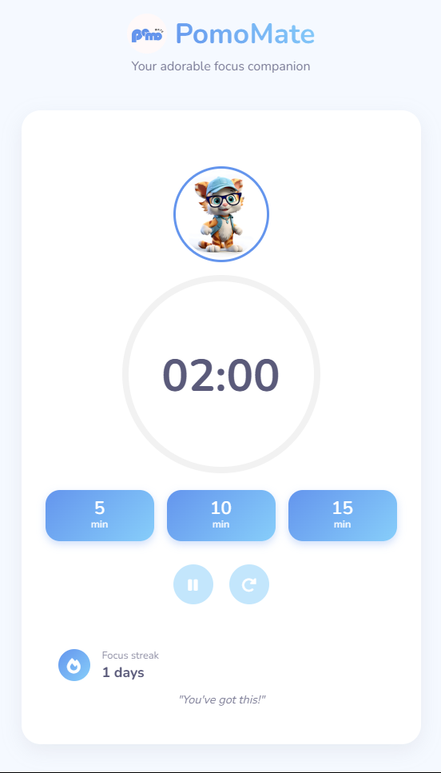

# PomoMate 🐱

## Your Adorable Focus Companion

PomoMate is a cute and friendly Pomodoro timer designed to help you stay focused and productive. With an adorable mascot cheering you on, maintaining your concentration has never been more fun!

## Features

- 🕒 Customizable timer options (5, 10, 15 minutes)
- 🔄 Pause and reset functionality
- 🌙 Light and dark mode toggle
- 🔥 Focus streak tracking
- 💬 Motivational messages from your cute companion
- 🔔 Audio notifications when time is up

## How to Use

1. Choose your desired focus time
2. Start the timer and focus on your task
3. Take a break when the timer ends
4. Track your daily focus streak

## Technologies Used

- HTML5
- CSS3
- JavaScript
- Font Awesome icons

## Preview

## Try It Out

Visit [PomoMate](https://pratyush1120.github.io/pomomate/) to start focusing with your new cute companion!

## About

Made with ❤️ by Pratyush.
